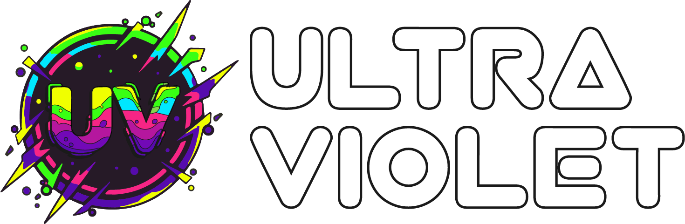
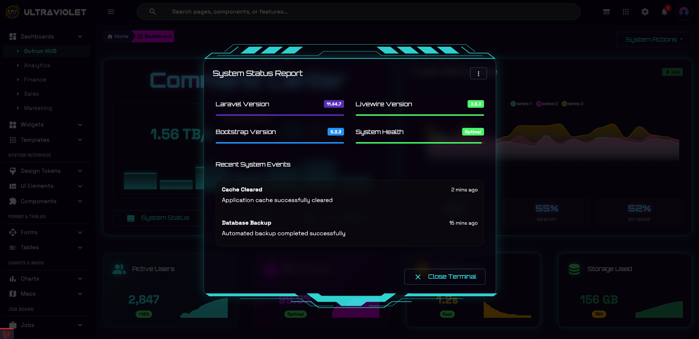

<div align="center">
  
</div>

<br>

<div align="center">
  
  [](LICENSE)
  []()
  [](https://getbootstrap.com)
  
</div>

<div align="center">
  <h3>🎁 Free Version - Get Started with UltraViolet</h3>
  <p>A stunning, futuristic admin dashboard template with HUD-style components and beautiful animations.<br>
  This free version gives you a taste of what's possible with UltraViolet Pro!</p>
</div>

---

## 🌟 Preview

<div align="center">
  
  <p><em>UltraViolet - Futuristic Admin Dashboard Template</em></p>
</div>

<div align="center">
  
  <p><em>Main Dashboard - Real-time metrics with stunning visual effects</em></p>
</div>

<div align="center">
  
  <p><em>HUD-Style Interface - Futuristic heads-up display elements</em></p>
</div>

## ✨ What's Included in the Free Version

This free version includes carefully selected components to give you a comprehensive preview of UltraViolet's capabilities:

### 📊 **Dashboard**
- **Main Dashboard** - Fully featured HUD dashboard with:
  - Animated network traffic charts
  - Real-time system metrics
  - Interactive quick actions panel
  - Feature comparison widgets
  - Live data simulations

### 🎨 **UI Components** (4 Essential Pages)
- **Alerts** - Beautiful notification styles with colors and icons
- **Buttons** - Multiple button variants and states
- **Modals** - HUD-styled modal dialogs with animations
- **Grid System** - Responsive Bootstrap 5 grid layouts

### 🚀 **Advanced Features**
- **HUD Interface** - Futuristic heads-up display components
- **Animated Backgrounds** - Stunning visual effects
- **Quick Actions Offcanvas** - Smooth sidebar navigation
- **Interactive Charts** - Live animated data visualization
- **Responsive Design** - Perfect on all devices

### 🎯 **Display Modes**
- HUD Mode with neon glow effects
- Dark theme optimized for long sessions
- Mobile-responsive layouts

## 🚀 Quick Start

### For Developers
```bash
# No installation needed! Just open in your browser
1. Extract the ZIP file
2. Open index.html in your web browser
3. Explore the dashboard and components
```

### For Designers
- All HTML files are clean and well-structured
- Modern CSS with Bootstrap 5.3.8
- Easy to customize colors and styles
- No build process required

### 🌐 Works Everywhere
- ✅ Works with `file://` protocol (no web server needed)
- ✅ All assets are included (no CDN dependencies)
- ✅ Compatible with all modern browsers
- ✅ Mobile and tablet friendly

## 📁 File Structure

```
ultraviolet-free/
├── index.html                      # Landing page showcasing features
├── admin-dashboard.html            # Main HUD dashboard
│
├── UI Components/
│   ├── admin-ui-alerts.html        # Alert component examples
│   ├── admin-ui-buttons.html       # Button styles and variants
│   ├── admin-ui-modals.html        # Modal dialogs with HUD styling
│   ├── admin-ui-grid.html          # Grid system demonstrations
│   └── admin-ui-popovers.html      # Popover components
│
├── Advanced Components/
│   ├── admin-analytics.html        # Analytics dashboard
│   ├── admin-components-toasts.html    # Toast notifications
│   ├── admin-components-timeline.html  # Timeline component
│   ├── admin-components-carousel.html  # Carousel examples
│   ├── admin-components-tabs.html      # Tab components
│   ├── admin-components-progress.html  # Progress indicators
│   └── admin-components-hud-elements.html  # HUD display system
│
├── Apps (Preview)/
│   ├── admin-apps-taskboard.html   # Kanban board preview
│   └── admin-apps-calendar.html    # Calendar preview
│
├── assets/                         # Compiled CSS & JS
│   ├── admin-vertical-dark.css     # Main stylesheet
│   └── bootstrap.css               # Bootstrap 5.3.8
│
├── js/                            # JavaScript files
│   ├── freebie.js                 # Main scripts
│   ├── basic.js                   # Core functionality
│   └── vendor/                    # Third-party libraries
│
├── images/                        # All images and assets
│   ├── uv/                        # UltraViolet branding
│   ├── promo/                     # Preview images
│   └── assets/                    # UI assets
│
└── README.md                      # This file
```

## 💎 Free vs Full Version Comparison

| Feature | Free Version | Full Version |
|---------|--------------|--------------|
| **Dashboard Pages** | 1 Main Dashboard | 5 Complete Dashboards |
| **Total Pages** | ~18 Pages | 80+ Pages |
| **UI Components** | 4 Basic Components | 40+ Components |
| **Apps** | 2 Previews | 7 Full Apps (Email, Chat, Calendar, etc.) |
| **Charts** | Basic Examples | Advanced Chart Library |
| **Forms** | ❌ | ✅ Complete Form System |
| **Tables** | ❌ | ✅ Advanced Data Tables |
| **Maps** | ❌ | ✅ Interactive Maps |
| **Widgets** | ❌ | ✅ 20+ Widget Types |
| **eCommerce** | ❌ | ✅ Complete eCommerce Pages |
| **Crypto** | ❌ | ✅ Crypto Dashboard & Wallet |
| **Authentication** | ❌ | ✅ Complete Auth System |
| **Documentation** | ❌ | ✅ 35+ Doc Pages |
| **Menu Layouts** | Vertical Only | Vertical + Horizontal |
| **Laravel Livewire** | ❌ | ✅ Full Livewire Edition |
| **Support** | Community | Premium Support |
| **Updates** | ❌ | ✅ Lifetime Updates |

## 🎯 What Makes UltraViolet Special?

### 🌈 **Unique UltraViolet Theme**
UltraViolet isn't just another admin template. It features:
- **Vibrant ultraviolet color palette** that stands out
- **HUD-style components** inspired by sci-fi interfaces
- **Neon glow effects** and animated backgrounds
- **Dark theme optimized** for reduced eye strain

### ⚡ **Modern Tech Stack**
- **Bootstrap 5.3.8** - Latest CSS framework
- **Alpine.js** - Lightweight JavaScript framework
- **ApexCharts** - Beautiful interactive charts
- **Material Icons** - Comprehensive icon library
- **No jQuery** - Modern, lightweight code

### 🎨 **Premium Design System**
- Carefully crafted color palette
- Consistent spacing and typography
- Smooth animations and transitions
- Professional, polished look and feel

## 🚀 Upgrade to Full Version

Ready to unlock the full potential? The complete version includes:

### 📦 **80+ Pages**
- 5 Complete Dashboard Variations
- Full-featured Applications (Email, Chat, Calendar, File Manager, Kanban, AI Agent)
- eCommerce Pages (Products, Orders, Checkout)
- Crypto Dashboard & Wallet
- Authentication System (Login, Register, Password Reset)
- Profile & Account Management
- And much more!

### 🎨 **Advanced Features**
- **Horizontal + Vertical Menus** - Choose your preferred layout
- **Laravel Livewire Edition** - Full reactive components
- **Complete Documentation** - 35+ documentation pages
- **Rich Text Editor** - Quill.js integration
- **Interactive Maps** - Mapbox GL integration
- **Advanced Tables** - Sorting, filtering, pagination
- **Form Validation** - Complete form system

### 💼 **Business Benefits**
- **Lifetime Updates** - Get all future updates free
- **Premium Support** - Direct support from our team
- **Commercial License** - Use in unlimited projects
- **Source Code** - Full access to all files
- **Regular Updates** - New features added monthly

### 🎁 **Special Launch Offer**
Visit [Huement.com](https://huement.com) to get UltraViolet Pro at a special launch price!

## 🌟 About Huement

**Huement.com** is a leading web design and development agency specializing in modern, responsive web applications. We create beautiful, functional, and user-friendly digital experiences.

### 📖 **Free Resources & Learning**
- **[Huement Blog](https://huement.com/blog)** - Free tutorials, templates, and web development tips
  - Laravel development guides
  - Modern CSS techniques
  - Design system best practices
  - And much more free content!

### 🔗 **Connect With Us**
- **Website**: [huement.com](https://huement.com) - Premium templates and services
- **Blog**: [huement.com/blog](https://huement.com/blog) - Free tutorials and resources
- **Portfolio**: [huement.com/portfolio](https://huement.com/portfolio) - See our latest work
- **Documentation**: [docs.huement.com](https://docs.huement.com) - Comprehensive guides

## 💡 Need Help?

### 📚 **Resources**
- Check out our [blog](https://huement.com/blog) for tutorials and tips
- Browse the included example pages for implementation ideas
- View source code - everything is well-commented!

### 🤝 **Support**
- **Documentation**: [docs.huement.com](https://docs.huement.com)
- **Email**: support@huement.com
- **Website**: [huement.com](https://huement.com)

## 📄 License

This free version is licensed under the [MIT License](LICENSE). 

**What this means:**
- ✅ Use in personal projects
- ✅ Use in commercial projects
- ✅ Modify as needed
- ✅ No attribution required (but appreciated!)

## 🙏 Thank You!

Thank you for trying UltraViolet! We hope this free version gives you a great preview of what's possible. If you create something amazing with it, we'd love to see it!

### ⭐ Show Your Support
- Star us on GitHub
- Share with fellow developers
- Follow us on social media
- Check out our [blog](https://huement.com/blog) for more free resources

---

<div align="center">
  <p><strong>Made with ❤️ by <a href="https://huement.com">Huement.com</a></strong></p>
  <p>
    <a href="https://huement.com">🌐 Website</a> •
    <a href="https://huement.com/blog">📖 Blog</a> •
    <a href="https://docs.huement.com">📚 Docs</a> •
    <a href="https://huement.com/portfolio">🎨 Portfolio</a>
  </p>
  <br>
  <p><em>Ready to upgrade? Visit <a href="https://huement.com">Huement.com</a> for the full version!</em></p>
</div>