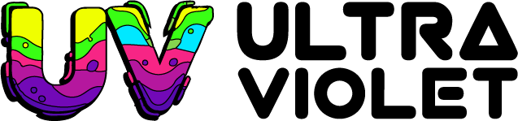

# UltraViolet - Free Version

<div align="center">
  
</div>

<br>

A limited free version of UltraViolet admin dashboard template. This version includes:

## 🎁 What's Included

- ✅ **Dashboard** - Main dashboard page with sample widgets
- ✅ **UI Elements** - Basic UI components:
  - Alerts
  - Buttons
  - Modals
  - Grid System

## 🚀 Quick Start

1. Open `index.html` in your web browser
2. No installation required!
3. Works with `file://` protocol (no web server needed)

## 📁 File Structure

```
freebie/
├── index.html              # Freebie landing page
├── admin-dashboard.html    # Main dashboard
├── admin-ui-alerts.html    # Alerts examples
├── admin-ui-buttons.html   # Button styles
├── admin-ui-modals.html    # Modal dialogs
├── admin-ui-grid.html      # Grid system
├── assets/                 # CSS & JS assets
├── images/                 # Images
└── README.md              # This file
```

## 🌟 Want More?

This is a limited free version. The full version includes:

- **50+ Pages** - Complete admin dashboard
- **Multiple Layouts** - Vertical & Horizontal menus
- **Apps** - Email, Chat, Calendar, File Manager, Kanban, AI Agent
- **Charts** - ApexCharts, Chart.js
- **Tables** - Advanced data tables
- **Maps** - Google Maps, Vector maps
- **Forms** - Validation, layouts
- **Widgets** - Stats, lists, charts
- **eCommerce** - Products, orders
- **Crypto** - Wallet, exchange
- **And much more!**

Visit [Huement.com](https://huement.com) to purchase the full version.

## 📄 License

This free version is licensed under MIT. 

---

<div align="center">
  <p>Made with ❤️ by <a href="https://huement.com">Huement.com</a></p>
</div>